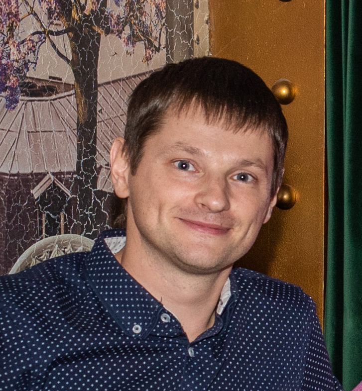

# ***Nosov Mikhail***
[](photo.png)

## **Contacts**


### telegram: **@ziglobe**

### email: **manosov1984@gmail.com**

### github: **nos64**

### discord: **MIHAIL NOSOV (@nos64)**

***********

## **About me**


My name is Michael. Currently I work as an engineer in the power industry. I decided to radically change my occupation - to study as a web developer and develop in this area. For 3 months now I have been learning HTML, CSS and JavaScript on my own.
I have good analytical skills. Easy to teach. I work well in a team.

## **Skills**
* HTML5, CSS3;

* JavaScript(the basics);

* Git, Github;

* Adobe Photoshop, Figma;

## **Code example**
JavaScript tip app code

```
const calcBtn = document.querySelector('.calc-btn');
const form = document.querySelector('.form');
const outTip = document.querySelector('.tip__value');
const totalPerPerson = document.querySelector('.total__value');


calcBtn.addEventListener('click', ()=> {
  event.preventDefault();
  const billValue = +form.elements.billValue.value;
  const peopleValue = +form.elements.peopleValue.value;
  const persentTip = +form.elements.radio.value;
  const warning = document.querySelector('.warning-mesage')
 if (billValue && peopleValue) {
  warning.style.display = 'none';
  outTip.textContent = (billValue * persentTip).toFixed(2);
  totalPerPerson.textContent = ((billValue + billValue * persentTip) / peopleValue).toFixed(2);
 } else {
  warning.style.display = 'flex';
 }
});

```

## **Completed projects**
### My little pet projects:

* Registration form with validation:
[Registration form](https://jolly-bassi-acf2c9.netlify.app/);

* Application for launching a spacecraft, the angle of inclination and flight speed are regulated by sliders (Password for the form: "1"):
[Open Space](https://jovial-lamarr-a3e08c.netlify.app/);
* Layout of a responsive page based on the Figma layout. It is possible to choose packages by clicking on the image or by following the link below:
[Cat's food](https://relaxed-turing-6a99b0.netlify.app/);
* Simple text converter:
[Text converter](https://loving-bell-d31a0d.netlify.app/);
* Pomodoro timer:
[Pomodoro timer](https://github.com/nos64/advent_pomodoro-timer);
* Tip calculator:
[Tip calculator](https://github.com/nos64/07_advent_tip-calc);

## **Education**

2001 - 2006 **Saratov State Agrarian University N.I. Vavilova**

Power supply of agricultural enterprises

## **Courses**

* **Stepik** "Web Development for Beginners: HTML and CSS";
* **Stepik** "Introduction to computer architecture. Elements of operating systems";
* **JetBrainsAcademy** "Frontend Developer";
* **RS School** "JavaScript/Front-end. Stage 0".

## **Languages**
* English (A2 Pre-Intermidate);
* Russian (Native).
